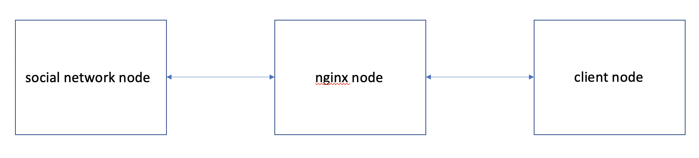

# Current state of the Project

## Architecture

Note: In practice, currently there are 3 social network nodes providing all three services.

## Details

- gen_load creates simulated workload that generates three types of requests:
  - Read user's home timeline
  - Compose a post
  - Read another user's timeline
- While this load is running two other python scripts run
  - get_states.py (on the client node)
  - change_nginx_weights.py (on the nginx node)
- The gen_states script gathers system performance data, while the workload generator runs, from the nginx node and saves it to the nginx_state_for_clustering.json file. Following metrics are collected for each backend(the script contains a few more):
  - inBytes and outBytes: A representation of the current load
  - Non 2xx/3xx responses: Number of failures
  - weight: weight of this particular server
  - requestMsec: average response time
- The change_nginx_weights script runs on the nginx node and random changes the weights on the servers between 1 (low priority of choosing this server for this request), 3 and 5.
- I ran the test for a few hours changing weights and collecting data at the same interval of 2 seconds. This resulted in the collection of almost seven thousand instances of state data.
- Next I wanted to discretize this data into a fixed number of states. For this I created the gmm_states.py script (gmm_states_v2.py). This script does the following:
  - Uses Gaussian Mixture Model to cluster the entries into 27 different states.
  - The number of states has been, arbitrarily, determined to be 3^3 = 27. The logic is that every request type can be in three distinct states:
    - HIGH
    - MEDIUM
    - LOW

## Where have I fallen behind

- The immediate next step is to calculate how a state changes given a change in the controls. Given this information we can calculate the probability with which the system transitions to any given state from a starting state by applying a change of control. This would be implemented in the gmm_state script. Currently, the skeleton of this has been implemented in gmm_state script but it is incomplete as it does not take into account change of control.
- Once these transition probabilities are calculated, we then want to calculate a policy that would tell us how the system might attempt to transition from any state to a more desirable state. This learned policy will basically be the scheduling algorithm.

## How I plan to catch up

- The first challenge is a coding problem that can hopefully be solved by allocating more time to it.
- The second one is a little more conceptually involved as I still need to find a method of doing this reasonably fast.